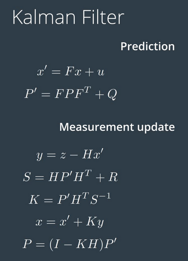

# Term2_Proj1_EKF
Extended Kalman Filter

The target of this project is to apply Extended Kalman Filter to fuse data from LIDAR and Radar of a self driving car using C++ (Eclipse IDE).

## Content of this repo
- `scr` source code directory:
  - `main.cpp` - communicate with simulation tool, call functions to run the Kalman filter and calculate RMSE
  - `FusionEKF.cpp` - initializes the Kalman filter, execute predict and update function of Kalman filter
  - `kalman_filter.cpp`- defines the predict function, the update function for lidar, and the update function for radar
  - `tools.cpp` - calculate RMSE and the Jacobian matrix

## Kalman Filter Implementation


Pls be noted:
Lidar can directly use standard Kalman filter, because the process function and measure function are both linear.
Radar has nonlinear measure function, which should be linearized use Jacobian matrix in each time step.

## Result


|RMSE |Lidar&Radar  |Radar      |Lidar  |
| --- | --- |--- |--- |
|Px   |0.0973       |0.2302     |0.1473 |
|Py   |0.0855       |0.3464     |0.1153 |
|Vx   |0.4513       |0.5835     |0.6383 |
|Vy   |0.4399       |0.8040     |0.5346 |

From the results, it can be seen Lidar is more accurate, while neither of Lidar or Radar can meet the accuracy request seperately.


## How to run the code
Clone this repo and perform
```
mkdir build && cd build
cmake ../src/  && make
./ExtendedKF 
./ExtendedKF 
```


